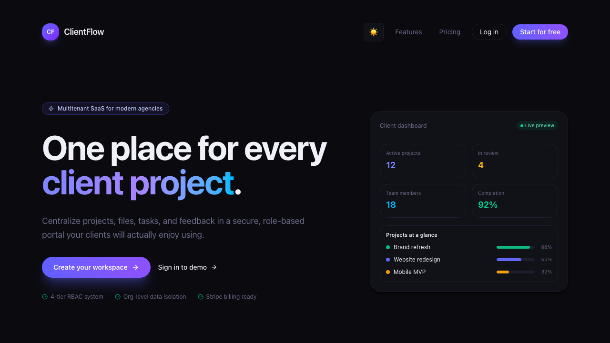
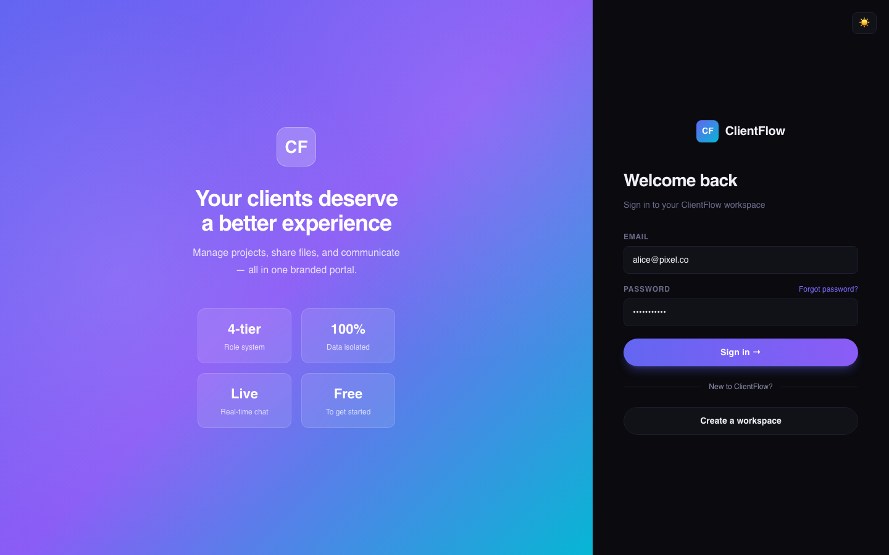
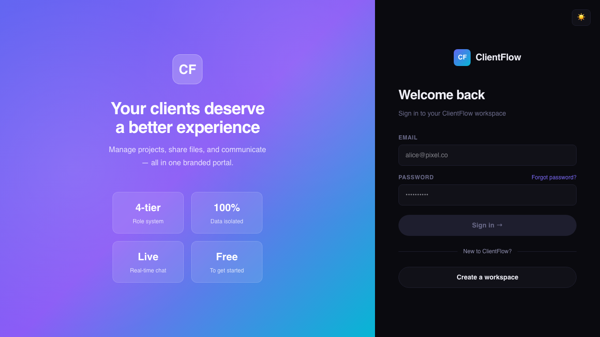

# ClientFlow


**A production-grade, multitenant B2B SaaS platform with 4-tier RBAC, org-scoped data isolation, and a white-label client portal — engineered for modern digital agencies.**

> **[🚀 Live Demo → client-flow-sooty.vercel.app](https://client-flow-sooty.vercel.app)**

---

## 🎯 For Recruiters & Hiring Managers

**ClientFlow** is a comprehensive demonstration of my ability to architect, build, and deploy complex full-stack applications. It goes far beyond a typical CRUD app by addressing hard, real-world engineering challenges:

- **Complex Data Architecture:** Engineered a rock-solid multitenant PostgreSQL database schema where user data is strictly cordoned off by their Organization ID.
- **Enterprise Security:** Implemented an implicit "Iron Curtain" data-access proxy to prevent cross-tenant data leaks—backed by robust integration tests.
- **Modern React Paradigms:** Extensively leverages Next.js 15 React Server Components (RSC) to minimize client-side javascript while delivering blazing fast edge performance.
- **Production Resilience:** Solved database cold-start timeouts and connection scaling limits characteristic of serverless environments by implementing robust singleton connection pooling and intuitive React Error Boundaries.
- **Polished UX:** Designed a premium, agency-quality interface demonstrating advanced knowledge of CSS variables, dynamic theming (dark/light mode), and subtle micro-interactions.

---

## 📸 Product Preview

<div align="center">
  
  <br/>
  <em>Modern, conversion-optimized landing page built with Tailwind CSS v4 and dynamic theming.</em>
</div>

<br/>

<div align="center">
  
  <br/>
  <em>Agency Dashboard featuring real-time activity feeds, live task metrics, and role-based access controls.</em>
</div>

<br/>

<div align="center">
  
  <br/>
  <em>Seamless, themeable authentication flow handling multitenant session management.</em>
</div>

---

## 🔑 Demo Credentials

To experience the **complete data isolation** first-hand, log into these two tenants in separate browser windows to verify the "Iron Curtain" — there is absolutely no cross-tenant data leakage.

| Tenant | Role | Email | Password |
| :--- | :--- | :--- | :--- |
| **Pixel Agency** (Pro) | Admin | `alice@pixel.co` | `password123` |
| | Manager | `bob@pixel.co` | `password123` |
| | Member | `carol@pixel.co` | `password123` |
| | Client | `dave@acme.com` | `password123` |
| **Nova Studio** (Starter) | Admin | `admin@nova.io` | `password123` |

> **Leak Test:** Log into Pixel Agency in one tab and Nova Studio in an incognito window. Copy a project URL from one and paste it into the other — you'll hit a `403 Forbidden` or `404`. That's the org-scoped isolation natively working.

---

## ✨ Technical Highlights

| Area | What Was Built |
| :--- | :--- |
| **Security & Validation** | Engineered a centralized validation layer using **Zod**, ensuring type-safety across the entire JavaScript monolith. Every API route validates input through shared schemas before touching the database. |
| **Data Isolation** | Built an **org-scoped query proxy** (`withOrgScope`) that automatically injects `orgId` into every Prisma query — making it architecturally impossible to access another tenant's data, even by accident. |
| **Infrastructure & Auditability** | Implemented an **immutable Audit Log** system, providing a tamper-proof history of every organizational change (project CRUD, member invites, role changes, file uploads) for compliance and transparency. |
| **White-Label Architecture** | Developed a dynamic theming engine that injects tenant-specific CSS variables (`primaryColor`) via the root layout, allowing full brand customization for agency tenants without CSS bloat. |
| **Rate Limiting** | Integrated **Upstash Redis** sliding-window rate limiters on auth and invite endpoints to prevent brute-force attacks at the edge. |
| **File Management** | Built secure S3-backed file uploads using **presigned URLs** — the server never touches the file bytes, keeping the serverless footprint minimal. |

---

## 🏗 Architecture

```
┌─────────────────────────────────────────────────────────────┐
│                      CLIENT (Browser)                       │
│   React Server Components + Client Components (Next.js 15) │
│   <Can permission="..."> RBAC gate │ Optimistic UI updates  │
└──────────────────────────┬──────────────────────────────────┘
                           │
                    ┌──────▼──────┐
                    │  Middleware  │  ← Session validation
                    └──────┬──────┘
                           │
          ┌────────────────┼────────────────┐
          │                │                │
   ┌──────▼──────┐  ┌─────▼──────┐  ┌──────▼──────┐
   │  API Routes │  │  NextAuth  │  │  Webhooks   │
   │ /api/*      │  │  JWT + DB  │  │  Stripe     │
   └──────┬──────┘  └────────────┘  └─────────────┘
          │
   ┌──────▼───────────────────────────────────────┐
   │            SECURITY LAYER                     │
   │  assertPermission(session, "createProject")   │
   │  withOrgScope(orgId).project.findMany(...)    │
   │  validate(createProjectSchema, body)          │
   │  checkRateLimit(authLimiter, ip)              │
   └──────┬───────────────────────────────────────┘
          │
   ┌──────▼──────┐  ┌──────────┐  ┌──────────┐
   │  PostgreSQL │  │  AWS S3   │  │  Upstash  │
   │  (Neon)     │  │  Files    │  │  Redis    │
   └─────────────┘  └──────────┘  └──────────┘
```

---

## 🔒 Role Permissions Matrix

| Permission | Admin | Manager | Member | Client |
| :--- | :---: | :---: | :---: | :---: |
| Create projects | ✅ | ✅ | ❌ | ❌ |
| Delete projects | ✅ | ❌ | ❌ | ❌ |
| Create/update tasks | ✅ | ✅ | ✅ | ❌ |
| Upload files | ✅ | ✅ | ✅ | ❌ |
| Comment on projects | ✅ | ✅ | ✅ | ✅ |
| Invite members | ✅ | ✅ | ❌ | ❌ |
| Change member roles | ✅ | ❌ | ❌ | ❌ |
| View billing/plan | ✅ | ❌ | ❌ | ❌ |
| Update/delete org | ✅ | ❌ | ❌ | ❌ |
| View all projects | ✅ | ✅ | ✅ | ❌ |
| View assigned only | — | — | — | ✅ |

Permissions are enforced **twice**: on the server via `assertPermission()` in every API route, and on the client via the `<Can>` component that conditionally renders UI elements.

---

## 🛠 Tech Stack

| Layer | Technology | Why |
| :--- | :--- | :--- |
| **Framework** | Next.js 15 (App Router) | Stable RSC support, file-based routing, middleware |
| **Database** | PostgreSQL (Neon) | Serverless Postgres with connection pooling |
| **ORM** | Prisma 6 | Type-safe queries, migrations, seeding |
| **Auth** | NextAuth.js v5 | JWT sessions, Credentials provider, PrismaAdapter |
| **Styling** | Tailwind CSS v4 + Lucide | Utility-first CSS, tree-shakeable icons |
| **Rate Limiting** | Upstash Redis | Edge-compatible sliding window limiters |
| **Storage** | AWS S3 | Presigned uploads — zero server bytes |
| **Email** | Resend | Transactional invite emails with HTML templates |
| **Payments** | Stripe | Checkout, Customer Portal, webhook sync |
| **Validation** | Zod | Runtime schema validation for all API inputs |
| **Testing** | Vitest | 8 multitenancy isolation tests |
| **Deployment** | Vercel | Instant deploys, edge middleware |

---

### 🌟 Key Features

- **Multi-tenant isolation** — Every DB query scoped by orgId. Tenant A physically cannot access Tenant B's data.
- **4-tier RBAC** — Admin, Manager, Member, Client with 15 granular permissions enforced server AND client side
- **Real-time chat** — Pusher-powered instant messaging per organization with typing indicators
- **Member workload tracking** — See what every team member is working on, their task completion rate, and availability status
- **Activity log** — Immutable audit trail of every action
- **File uploads** — Presigned Cloudflare R2 URLs, server never touches file bytes
- **Invite system** — Token-based email invites via Resend, 48h expiry, role pre-assignment
- **Light/Dark mode** — Full theme system with CSS variables, persisted via localStorage
- **Graceful degradation** — App works without Stripe/S3/Email configured — services fail silently with helpful UI messages

---

## 🧠 Technical Hurdles & Design Decisions

### Why a Monolith Over Microservices?

ClientFlow is intentionally built as a **modular monolith**. For a B2B SaaS serving agencies with <10K tenants, the overhead of microservices (service mesh, distributed tracing, eventual consistency) introduces complexity without proportional benefit. The monolith gives us:

- **Transactional integrity** — Deleting an org cascades through projects, tasks, files, comments, and invites in a single ACID transaction.
- **Shared type safety** — Zod schemas and Prisma types are shared across the entire codebase. No contract drift.
- **Deployment simplicity** — One `vercel --prod` deploys everything. No orchestration layer needed.

The architecture is nonetheless **extraction-ready**: `lib/` modules (`auth.js`, `stripe.js`, `s3.js`, `email.js`) are self-contained and could be extracted into serverless functions or microservices if scale demands it.

### How Data Isolation Works (The "Iron Curtain")

Every database query in the app is scoped to the authenticated user's `orgId`. This is enforced at three levels:

1. **Schema Design** — Every model (Project, Task, File, Comment, AuditLog) has an `orgId` foreign key. There is no data without an owner.

2. **Query Proxy** — The `withOrgScope(orgId)` utility wraps Prisma delegates in a Proxy that automatically injects `orgId` into every `where` clause:
   ```js
   // Instead of risking: prisma.project.findMany({})
   // We enforce: withOrgScope(session.user.orgId).project.findMany({})
   // The proxy ensures orgId is ALWAYS present.
   ```

3. **API Layer** — Every route handler extracts `orgId` from the JWT session and passes it down. There is no code path that can skip this.

This architecture was validated with **8 dedicated multitenancy tests** (Vitest) that attempt cross-tenant reads, writes, and deletes — all of which correctly return `403` or `404`.

### Handling Build-Time vs Runtime

A key challenge deploying to Vercel was Next.js's aggressive static analysis during builds. Libraries like Prisma and Stripe attempt to connect to external services when their modules are imported — which fails during the build phase where no database exists.

**Solution:** Lazy-loading Proxies. Both `prisma` and `stripe` clients are wrapped in ES6 `Proxy` objects that defer initialization until the first actual method call:
```js
export const prisma = new Proxy({}, {
  get(target, prop) {
    if (!_prisma) _prisma = new PrismaClient();
    return _prisma[prop];
  }
});
```
This ensures zero side-effects at import time — the clients only wake up when a user actually triggers a request.

---

## 📂 Project Structure

```
app/
├── (app)/dashboard/          # Authenticated dashboard pages
│   ├── page.js               # Main dashboard (Server Component)
│   ├── members/              # Team management (RBAC-gated)
│   ├── projects/[id]/        # Project detail: Tasks / Files / Comments tabs
│   └── settings/             # Org settings + billing + audit log + danger zone
├── (auth)/                   # Login & Signup flows
├── api/                      # 15 REST API routes
│   ├── auth/[...nextauth]/   # NextAuth with rate-limited POST
│   ├── billing/              # Stripe checkout & portal
│   ├── invites/              # Token-based team invites + accept flow
│   ├── members/              # Member CRUD + role changes
│   ├── orgs/                 # Org CRUD + audit export (CSV)
│   ├── projects/             # Project CRUD + tasks/files/comments
│   └── webhooks/stripe/      # Stripe webhook → plan sync
├── onboarding/               # Post-signup org creation flow
└── page.js                   # Landing page
lib/
├── auth.js                   # NextAuth v5 config (JWT + PrismaAdapter)
├── permissions.js            # RBAC permission map + assertPermission()
├── orgScope.js               # Org-scoped Prisma query proxy
├── prisma.js                 # Lazy-init Prisma client singleton
├── rateLimit.js              # Upstash sliding window rate limiters
├── stripe.js                 # Lazy-init Stripe client
├── s3.js                     # S3 presigned URL helpers
├── email.js                  # Resend HTML email templates
├── audit.js                  # Immutable audit trail logger
├── validations.js            # Zod schemas for all API inputs
├── env.js                    # Build-safe environment validation
└── plans.js                  # Plan feature definitions
components/
└── Can.jsx                   # Client-side RBAC gate component
__tests__/
├── multitenancy.test.js      # 8 tenant isolation tests
└── helpers/                  # Seed data & session mocking
```

---

## 🚀 Quick Start

### Prerequisites
- Node.js 18+
- PostgreSQL database (or use [Neon](https://neon.tech) free tier)
- npm or yarn

### Setup
```bash
# 1. Clone and install
git clone https://github.com/1tsadityaraj/ClientFlow.git
cd ClientFlow
npm install

# 2. Configure environment
cp .env.example .env
# Open .env and fill in required values:
# - DATABASE_URL (from Neon or local PostgreSQL)
# - NEXTAUTH_SECRET (run: openssl rand -base64 32)
# - NEXTAUTH_URL=http://localhost:3000

# 3. Setup database
npx prisma migrate dev
npx prisma db seed

# 4. Start development server
npm run dev
```

Open [http://localhost:3000](http://localhost:3000)

**Instant demo login (after seeding):**
- Admin: alice@pixel.co / password123
- Client: dave@acme.com / password123

### Optional Services
These services enhance the app but it works without them:
- **Pusher** — Real-time chat (falls back to polling)
- **Resend** — Invite emails (logs to console in dev)
- **Cloudflare R2** — File uploads (button disabled without it)
- **Upstash Redis** — Rate limiting (skipped without it)

---

## 🧪 Testing

```bash
npm run test             # Run all tests
npm run test:watch       # Watch mode
npm run test:coverage    # Coverage report
```

The test suite validates **multitenancy isolation** — ensuring that a user from Org A cannot read, update, or delete resources belonging to Org B across all API endpoints (projects, tasks, files, members).

---

## 📦 Deployment Checklist

- [x] PostgreSQL database (Neon)
- [x] Environment variables on Vercel
- [x] Prisma migrations deployed
- [x] Demo data seeded (2 tenants, 6 users, 5 projects)
- [x] Upstash Redis (rate limiting active)
- [x] Cloudflare R2 (file storage active)
- [x] Resend (invite emails active)
- [ ] Stripe (India invite-only — pending)

---

## 🚀 Production Setup

1. **Set Environment Variables**: Add all variables from `scripts/vercel-env-list.sh` to your Vercel project settings.
2. **Setup Database**: From your local terminal (ensure `DATABASE_URL` points to production), run:
   ```bash
   npm run db:prod:setup
   ```
3. **Verify Seed**: Log in as an admin and visit `/api/admin/seed-check` to confirm the database is correctly populated.
4. **Deploy**: Push your changes to the `main` branch:
   ```bash
   git add .
   git commit -m "feat: complete activity log and production setup"
   git push origin main
   ```

---

## 🤝 Contributing

Contributions are welcome! Please:
1. Fork the repo
2. Create a feature branch: git checkout -b feat/your-feature
3. Commit your changes: git commit -m 'feat: add your feature'
4. Push to branch: git push origin feat/your-feature
5. Open a Pull Request

---

## 📄 License

MIT

---

Built with ❤️ by **[Aditya Raj](https://github.com/1tsadityaraj)**
